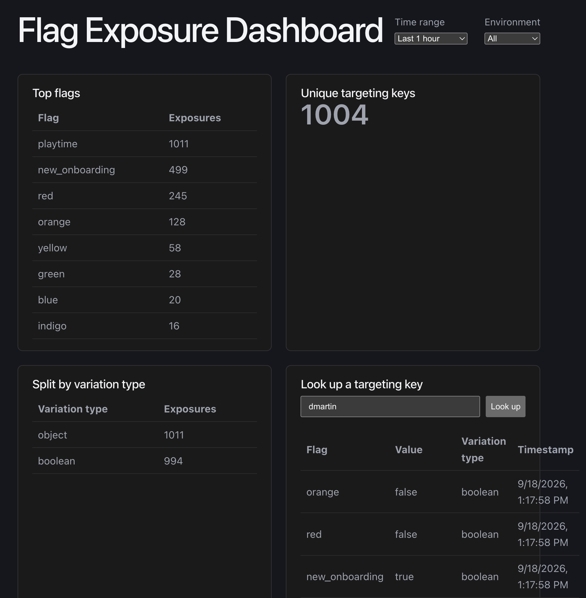

# Playtime

A demo of Datadog feature flags (via [OpenFeature](https://openfeature.dev/)) with a full exposure-logging pipeline: every flag evaluation is captured, written to S3, made queryable with Athena, and visualized in a small React dashboard.



## How it fits together

```
index.html / flags.js  --(OpenFeature evaluation)-->  Datadog
        |
        +--(audit logging hook, one JSON record per evaluation)--> S3 (exposures/<flag>/<file>.json)
                                                                          |
                                                                    AWS Glue table
                                                                          |
                                                                    Amazon Athena  <-- dashboard/api/*.js queries this
                                                                          |
                                                                 dashboard/ (Vite React + Vercel)
```

- **`index.html`** — a browser demo that evaluates a `playtime` object flag and a set of weighted boolean color flags via `@openfeature/web-sdk` + `@datadog/openfeature-browser`.
- **`flags.js`** — a Node.js CLI port of the same evaluation logic, using Datadog's official server-side stack (`dd-trace` + `@openfeature/server-sdk`). Every evaluation fires an OpenFeature audit-logging hook that writes an "exposure" record to S3.
- **`run-flags.sh`** — runs `flags.js` repeatedly with a delay, for generating sample exposure data.
- **`reload.js`** — a Puppeteer harness that reloads `index.html` in a real headless browser N times.
- **`dashboard/`** — a Vite React app deployed on Vercel. Its `/api/report` serverless function queries Athena directly (using the AWS SDK) and the frontend renders it as an interactive report: top flags (with a value drill-down), unique targeting key count, split by variation type, and per-targeting-key lookup, filterable by time range and environment.

## Prerequisites

- Node.js 22+ (required by `dd-trace`)
- An AWS account, with the [AWS CLI](https://docs.aws.amazon.com/cli/) configured locally (used only for the one-time setup below)
- A Datadog account with Feature Flags enabled, and a Datadog API key
- A [Vercel](https://vercel.com) account (free Hobby plan is enough) for hosting the dashboard

## AWS setup

All commands below use placeholders — replace `<bucket-name>` with a globally-unique name (e.g. `<your-project>-flag-exposures-<your-aws-account-id>`) and `<region>` with your AWS region (e.g. `us-west-2`).

### 1. Create the S3 bucket

```bash
aws s3api create-bucket \
  --bucket <bucket-name> \
  --region <region> \
  --create-bucket-configuration LocationConstraint=<region>
```

Leave "Block all public access" on (the default) — this bucket should stay private.

### 2. Create a write-only IAM user for `flags.js`

`flags.js` only ever needs to `PutObject` under the `exposures/` prefix.

```bash
aws iam create-user --user-name playtime-exposure-writer
```

Save this as an inline policy (e.g. `exposure-writer-policy.json`) and attach it:

```json
{
  "Version": "2012-10-17",
  "Statement": [
    {
      "Effect": "Allow",
      "Action": "s3:PutObject",
      "Resource": "arn:aws:s3:::<bucket-name>/exposures/*"
    }
  ]
}
```

```bash
aws iam put-user-policy \
  --user-name playtime-exposure-writer \
  --policy-name playtime-exposure-write \
  --policy-document file://exposure-writer-policy.json

aws iam create-access-key --user-name playtime-exposure-writer
```

Configure the resulting access key/secret as the default AWS credentials wherever `flags.js` runs (e.g. `aws configure`, or `AWS_ACCESS_KEY_ID`/`AWS_SECRET_ACCESS_KEY` env vars) — `flags.js` uses the AWS SDK's default credential provider chain, so no code changes are needed.

### 3. Create the Glue database and Athena table

In the Athena query editor (or via `aws athena start-query-execution`):

```sql
CREATE DATABASE IF NOT EXISTS playtime;

CREATE EXTERNAL TABLE playtime.exposures (
  targetingKey   string,
  flag           string,
  value          string,
  `timestamp`    bigint,
  variationType  string,
  env            string
)
ROW FORMAT SERDE 'org.openx.data.jsonserde.JsonSerDe'
LOCATION 's3://<bucket-name>/exposures/'
```

`value` is stored as a JSON-encoded **string** (not a native struct/boolean), because different flags produce different value shapes (`playtime` is an object, the color flags are booleans) — Athena/Glue needs one fixed type per column, so the exposure hook in `flags.js` does `JSON.stringify(evaluationDetails.value)` before writing. Query it at read time with `json_extract_scalar(value, '$.someField')`.

The first time you run an Athena query, you'll be asked for a **query result location** — point it at a prefix in the same bucket, e.g. `s3://<bucket-name>/athena-results/`.

### 4. Create a read-only IAM user for the dashboard

The dashboard only ever reads exposure data and queries Athena — it should never be able to write to `exposures/`.

```bash
aws iam create-user --user-name playtime-reporting
```

Inline policy (e.g. `reporting-readonly-policy.json`):

```json
{
  "Version": "2012-10-17",
  "Statement": [
    {
      "Sid": "S3ReadExposures",
      "Effect": "Allow",
      "Action": ["s3:GetObject", "s3:ListBucket", "s3:GetBucketLocation"],
      "Resource": [
        "arn:aws:s3:::<bucket-name>",
        "arn:aws:s3:::<bucket-name>/*"
      ]
    },
    {
      "Sid": "S3WriteAthenaResultsOnly",
      "Effect": "Allow",
      "Action": "s3:PutObject",
      "Resource": "arn:aws:s3:::<bucket-name>/athena-results/*"
    },
    {
      "Sid": "GlueReadOnly",
      "Effect": "Allow",
      "Action": ["glue:GetDatabase", "glue:GetDatabases", "glue:GetTable", "glue:GetTables", "glue:GetPartitions"],
      "Resource": "*"
    },
    {
      "Sid": "AthenaQueries",
      "Effect": "Allow",
      "Action": ["athena:StartQueryExecution", "athena:GetQueryExecution", "athena:GetQueryResults", "athena:GetWorkGroup", "athena:StopQueryExecution"],
      "Resource": "*"
    }
  ]
}
```

```bash
aws iam put-user-policy \
  --user-name playtime-reporting \
  --policy-name playtime-reporting-readonly \
  --policy-document file://reporting-readonly-policy.json

aws iam create-access-key --user-name playtime-reporting
```

You'll use this access key/secret as the dashboard's `AWS_ACCESS_KEY_ID`/`AWS_SECRET_ACCESS_KEY` (see below). Worth double-checking it's actually read-only before wiring it up anywhere public-facing — e.g. confirm a write attempt is denied:

```bash
echo test | aws s3 cp - s3://<bucket-name>/exposures/permission-check.txt \
  --profile <profile-using-the-new-key>
# should fail with AccessDenied
```

### 5. Validate data is arriving

Run the CLI once with real credentials (see [Running the CLI](#running-the-cli) below), then confirm a row shows up:

```bash
aws athena start-query-execution \
  --query-string "SELECT COUNT(*) AS n FROM playtime.exposures" \
  --query-execution-context Database=playtime \
  --result-configuration OutputLocation=s3://<bucket-name>/athena-results/ \
  --query 'QueryExecutionId' --output text
```

Then, a couple of seconds later:

```bash
aws athena get-query-results --query-execution-id <id-from-above>
```

You should see a count greater than zero. (Or just run the same query in the Athena console's query editor.)

## Environment variables

| Variable | Used by | Notes |
|---|---|---|
| `DD_API_KEY` | `flags.js` | Datadog API key |
| `DD_SITE` | `flags.js` | e.g. `datadoghq.com` |
| `DD_ENV` | `flags.js` | Datadog env tag, e.g. `prod` |
| `EXPOSURE_S3_BUCKET` | `flags.js`, `dashboard/api` | The bucket created in step 1 |
| `AWS_ACCESS_KEY_ID` / `AWS_SECRET_ACCESS_KEY` | `flags.js` (via default AWS credential chain) and `dashboard/api` | Use the write-only user's key for `flags.js`, the read-only `playtime-reporting` user's key for the dashboard |
| `AWS_REGION` | `dashboard/api` | Region the bucket/Athena live in |
| `DEPLOYMENT_WEBHOOK_SECRET` | `dashboard/api` (webhook), `simulate-deploy.js` | Shared secret the webhook checks against the `x-deploy-webhook-secret` header — see [Deployment tracking](#deployment-tracking) |
| `DEPLOYMENT_WEBHOOK_URL` | `simulate-deploy.js` | The deployed webhook's URL, e.g. `https://<your-deployment>.vercel.app/api/deployment-event` |

## Running the CLI

```bash
DD_API_KEY=<key> DD_SITE=<site> DD_ENV=<env> EXPOSURE_S3_BUCKET=<bucket-name> node flags.js
```

Each run does one weighted evaluation pass (mirroring `index.html`'s single page-load behavior) and writes one exposure record per flag evaluated. To generate a batch of sample data:

```bash
./run-flags.sh          # 100 runs, 1s apart (defaults)
./run-flags.sh 50 2     # 50 runs, 2s apart
```

## Running the dashboard

```bash
cd dashboard
npm install
```

Local env vars go in `dashboard/.env.local` (gitignored):
```
AWS_ACCESS_KEY_ID=...
AWS_SECRET_ACCESS_KEY=...
AWS_REGION=...
EXPOSURE_S3_BUCKET=...
```

Then either run the Vite dev server directly (`npm run dev`) or use `vercel dev` to exercise the `/api` serverless functions locally.

To deploy:
```bash
vercel deploy         # preview
vercel deploy --prod  # production
```

The same three AWS variables plus `EXPOSURE_S3_BUCKET` need to be registered as Vercel project env vars (Project Settings → Environment Variables, or `vercel env add <NAME> production,preview,development --sensitive`) for all three environments.

## Deployment tracking

The dashboard can annotate its time-series charts with a vertical line marking when a deployment happened — gold for a successful deploy, red for a failed one, with a hover tooltip showing full detail. In real life this event would come from a CI/CD system (Jenkins, GitHub Actions, GitLab CI — any of them can do a plain HTTP POST as a pipeline step); this project uses a generic webhook plus a CLI script that stands in for that CI step. The record shape deliberately mirrors [Datadog's own Deployment Tracking / DORA Metrics API](https://docs.datadoghq.com/api/latest/dora-metrics/) (`service`, `env`, `version`, `started_at`, `finished_at`, plus this project's own `change_failure` boolean), so swapping in the real API later is mostly a matter of pointing at a different URL.

### 1. Create the Glue table

```sql
CREATE EXTERNAL TABLE playtime.deployments (
  service string,
  env string,
  version string,
  started_at bigint,
  finished_at bigint,
  change_failure boolean,
  team string,
  git string,
  custom_tags string
)
ROW FORMAT SERDE 'org.openx.data.jsonserde.JsonSerDe'
LOCATION 's3://<bucket-name>/deployments/'
```

`git` and `custom_tags` are stored as JSON-encoded **strings**, same reasoning as `value` in the `exposures` table above.

### 2. Extend the read-only IAM user

Add this statement to the `playtime-reporting` policy from AWS setup step 4 (alongside its existing `S3WriteAthenaResultsOnly` statement — the `GlueReadOnly`/`AthenaQueries` statements already cover the new table via their `Resource: "*"`):

```json
{
  "Sid": "DeploymentEventsWrite",
  "Effect": "Allow",
  "Action": "s3:PutObject",
  "Resource": "arn:aws:s3:::<bucket-name>/deployments/*"
}
```

### 3. Set the webhook secret

```bash
vercel env add DEPLOYMENT_WEBHOOK_SECRET production,preview,development --sensitive
```

### 4. Fire a deployment event

`simulate-deploy.js` (repo root, plain Node, mirrors `flags.js`'s style) POSTs a synthetic deployment event to the webhook:

```bash
DEPLOYMENT_WEBHOOK_URL=https://<your-deployment>.vercel.app/api/deployment-event \
DEPLOYMENT_WEBHOOK_SECRET=<the secret from step 3> \
node simulate-deploy.js prod v1.4.0 success
```

Arguments are positional and all optional: `<env> <version> <success|failure> [service] [timestamp]` — defaults are `$DD_ENV` (or `prod`), a timestamp-based version tag, `success`, `playtime`, and now, respectively.

## Notes / gotchas encountered building this

- `dd-trace`'s agentless flag-config polling can keep the Node process alive after work is done — `flags.js` calls `process.exit(0)` explicitly once evaluation + exposure writes finish.
- `vercel env add` shows an interactive "Store as Secret or Config?" prompt for anything that looks like a credential; piping a value via stdin can't answer that prompt. Use `--sensitive` (or `--no-sensitive`) to skip it non-interactively, and `--force` to overwrite an existing value.
- Athena/Glue table columns are case-folded to lowercase regardless of how they're declared in `CREATE TABLE` — the OpenX JSON SerDe matches JSON keys case-insensitively, so camelCase fields in the exposure JSON (e.g. `variationType`) still work, but query results come back with lowercase column names (e.g. `variationtype`).
